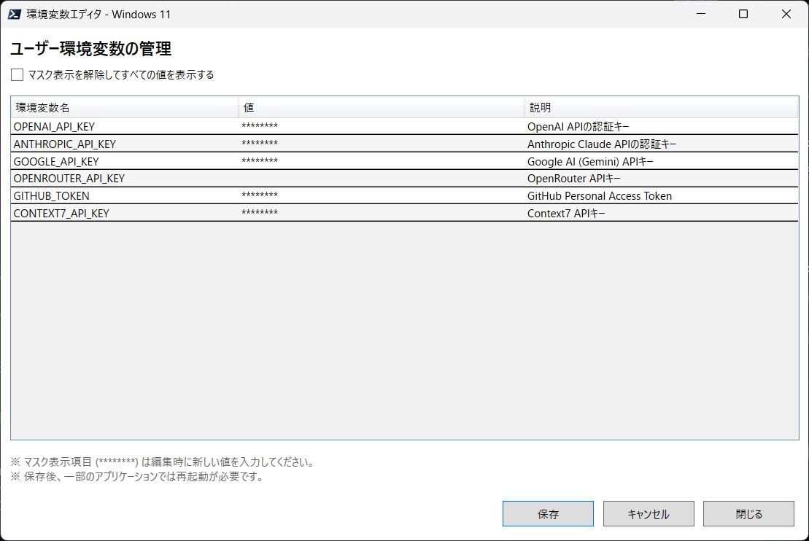

# 環境変数エディタ (Windows 11)


## 概要

Windows 11 向けの環境変数管理ツールです。AI 開発で使う API キーなどの環境変数を一覧で確認・編集できます。  
Windows の標準ツールでは不要な変数が混ざり順序も不規則になりがちなため、本スクリプトでは対象の変数を明示的に定義して管理します。  




### 主な機能

- **環境変数の一覧表示・編集**: 設定した環境変数を表で確認・編集
- **APIキーの保護**: 重要な値（APIキーなど）を `********` でマスク表示
- **変更の検知**: 保存していない変更があれば警告
- **単純構成**: 1つのファイルだけで動作

## システム要件

- **OS**: Windows 11
- **PowerShell**: PowerShell 7.x (pwsh)

### PowerShell 7 のインストール確認

PowerShell 7 がインストールされているか確認：

```powershell
pwsh --version
```

インストールされていない場合は、[PowerShell 公式サイト](https://docs.microsoft.com/ja-jp/powershell/)からダウンロードしてください。

## 使い方

### 起動方法

```powershell
pwsh -File env-settings-editor.ps1
```

または、PowerShell 7 がデフォルトシェルの場合:

```powershell
.\env-settings-editor.ps1
```

### 基本操作

起動すると定義済みの環境変数が一覧表示されます。セルをダブルクリックして編集し、下部の [保存] ボタンで変更を保存してください。未保存の変更がある場合は警告が表示されます。

## カスタマイズ方法

管理したい環境変数を追加・削除するには、[`env-settings-editor.ps1`](env-settings-editor.ps1) を開いて、スクリプト内の `$script:EnvVariableDefinitions` の部分を編集します。

### 設定例

```powershell
$script:EnvVariableDefinitions = @(
    [PSCustomObject]@{
        Name        = 'OPENAI_API_KEY'       # 環境変数名（表にも表示されます）
        Description = 'OpenAI APIの認証キー'  # 説明
        IsMasked    = $true                  # $true でマスク表示
        Scope       = 'User'                 # User 固定
    },
    [PSCustomObject]@{
        Name        = 'MY_PROJECT_HOME'
        Description = 'プロジェクトのパス'
        IsMasked    = $false                 # $false で値をそのまま表示
        Scope       = 'User'
    }
)
```

### 設定項目の説明

- **Name**: 環境変数名（表にもこの名前で表示されます）
- **Description**: 用途の説明
- **IsMasked**: `IsMasked = $true` の場合、値は `********` として表示されます。
- **Scope**: 現在は `'User'` のみ対応（ユーザー環境変数）

## 注意事項

### 環境変数の反映について

- 環境変数を保存しても、**既に起動中のアプリケーションには反映されません**
- PowerShell、コマンドプロンプト、VSCode、ブラウザなどは**再起動が必要**です
- 一部のアプリケーションは Windows への再ログインが必要な場合があります

### バックアップの推奨

重要な環境変数を編集する前にバックアップを取ることを推奨します。例:

```powershell
[System.Environment]::GetEnvironmentVariables([System.EnvironmentVariableTarget]::User) |
    ConvertTo-Json |
    Out-File "env_backup_$(Get-Date -Format 'yyyyMMdd_HHmmss').json"
```

### セキュリティ

- `IsMasked = $true` の環境変数は値が `********` で表示されます
- 編集対象は**ユーザー環境変数のみ**です（システム環境変数は変更されません）
- 設定に追加した環境変数のみが表示・編集できます（他の環境変数には影響しません）

## トラブルシューティング

### 環境変数が保存できない

1. PowerShell を完全に終了してから再実行してください
2. 環境変数名に使えない文字（空白や記号など）が含まれていないか確認してください

## 技術的補足

このセクションは開発者向けの情報です。

### アーキテクチャ

- **UI フレームワーク**: Windows Presentation Foundation (WPF)
- **STA モード**: WPF を使用するため、PowerShell を STA (Single-Threaded Apartment) モードで実行
  - スクリプトは自動的に STA モードを確認し、必要に応じて再起動します
- **テーブル駆動設計**: 環境変数の定義を配列で管理し、動的に UI を生成

### スクリプトの構造

1. STA モードチェック（必要に応じて再起動）
2. 環境変数定義テーブルの読み込み
3. WPF ウィンドウと DataGrid の動的生成
4. イベントハンドラの登録（保存、キャンセル、閉じる）
5. メインループの実行

### ファイル構成

```
win11_env_settings/
├── env-settings-editor.ps1  # メインスクリプト（すべての機能を含む）
└── README.md                # このファイル
```

## 参考情報

- [PowerShell 7 ドキュメント](https://docs.microsoft.com/ja-jp/powershell/)
- [環境変数の管理 (.NET)](https://docs.microsoft.com/ja-jp/dotnet/api/system.environment)
